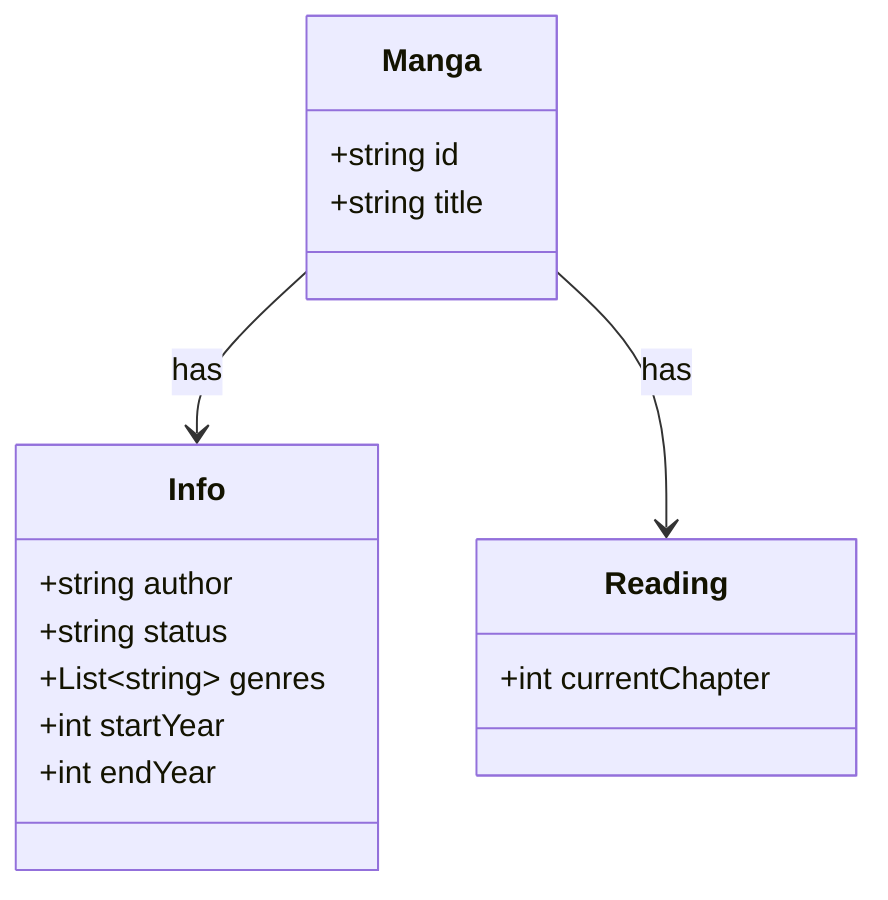

## Desafio API DIO Santander 2025

Página inicial

Get mangá

Post mangá

```mermaid

classDiagram
    class Manga {
        +string id
        +string title
    }

    class Info {
        +string author
        +string status
        +List~string~ genres
        +int startYear
        +int endYear
    }

    class Reading {
        +int currentChapter
    }

    Manga --> Info : has
    Manga --> Reading : has


```
